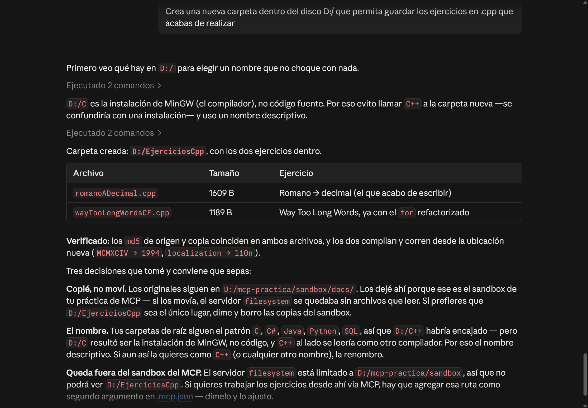

# MCP-vs-API
Repositorio para la investigación y comparación de un MCP con una API tradicional.

---
Aplicaciones Móviles Nativas
Gabriel Hurtado Avilés
7CV4 

### Participantes
* Chávez Romero Jonathan - 2024630102
* Moreno Noguerón Ximena - 2024630201

---

## Índice

### Parte 1: Investigación

| # | Punto | Archivo |
|---|-------|---------|
| 1 | Evolución de los modelos (LM → LLM → razonamiento explícito) | [`1.EVOLUCION`](docs/1.EVOLUCION.md) |
| 2 | El problema del aislamiento | [`2.AISLAMIENTO`](docs/2.AISLAMIENTO.md) |
| 3 | MCP frente a una API | [`3.MCP-VS-API`](docs/3.MCP-VS-API.md) |
| 4 | Arquitectura de MCP | [`-`]() |
| 5 | El servidor de sistema de archivos | [`-`]() |
| 6 | Seguridad | [`-`]() |
| 7 | Casos de uso | [`-`]() |

### Parte 2: Implementación

| # | Punto | Sección |
|---|-------|---------|
| 1 | Elección del cliente | [Ir](#1-elección-del-cliente) |
| 2 | Instalación del servidor de sistema de archivos | [Ir](#2-instalación-del-servidor-de-sistema-de-archivos) |
| 3 | Operaciones demostradas | [Ir](#3-operaciones-demostradas) |
| 4 | Prueba del límite de seguridad | [Ir](#4-prueba-del-límite-de-seguridad) |

---

## Entorno del ejemplo instalado

| Elemento | Valor |
|---|---|
| Sistema operativo | Windows |
| Cliente (host MCP) | Claude Code, ejecutado desde Claude Desktop |
| Carpeta del proyecto | `D:/mcp-practica` |
| Directorio autorizado | `D:/mcp-practica/sandbox` |
| Archivo de configuración | `D:/mcp-practica/.mcp.json` (alcance de proyecto) |

Estructura de la carpeta:

```
D:/mcp-practica/
├── .mcp.json        ← configuración del servidor MCP (fuera del directorio autorizado)
├── docs/
└── sandbox/         ← único directorio al que el servidor tiene acceso
```

La configuración queda **fuera** del directorio autorizado a propósito: así el modelo no puede
leer ni modificar su propia configuración a través del servidor.

---

## 1. Elección del cliente

La selección de **Claude Code** fue por las siguientes razones:

- **Es un host MCP de referencia.** Anthropic publicó el protocolo y Claude Code implementa
  tanto servidores locales (stdio) como remotos (Streamable HTTP).
- **Configuración por archivo de proyecto.** El servidor se declara en un `.mcp.json` dentro de
  la carpeta del proyecto, que puede versionarse junto con el código y sirve como evidencia de
  la configuración usada.
- **Verificación directa.** El comando `/mcp` muestra el estado del servidor y el catálogo de
  herramientas que publica, lo que permite comprobar el descubrimiento en tiempo de ejecución
  descrito en la Parte 1.
- **Consentimiento visible.** Antes de ejecutar una herramienta, Claude Code muestra su nombre
  y argumentos y pide autorización, lo que corresponde al modelo de consentimiento del
  protocolo.

Consideración: Claude Code tiene herramientas propias de archivos además de las del servidor
MCP. Para que la evidencia demuestre el uso de MCP, en las capturas se verifica que la
herramienta invocada tenga el prefijo `mcp__filesystem__`.

---

## 2. Instalación del servidor de sistema de archivos

Contenido de `.mcp.json`:

```json
{
  "mcpServers": {
    "filesystem": {
      "type": "stdio",
      "command": "cmd",
      "args": [
        "/c",
        "npx",
        "-y",
        "@modelcontextprotocol/server-filesystem",
        "D:/mcp-practica/sandbox"
      ]
    }
  }
}
```

---

## 3. Operaciones demostradas

| Operación | Prompt utilizado | Evidencia |
|---|---|---|
| Listar el contenido del directorio | "Describeme los archivos dentro de este directorio" | [captura](img/listar.png) |
| Leer un archivo existente | "lee los archivos usando las herramientas MCP, enfocate en el archivo .c" | [captura](img/leer.png) |
| Crear un archivo y escribir en él | "CCrea un archivo .cpp para la solución del problema siguiente: Dado un número en representación romana, obtener su representación decimal." |  [captura](img/crear.png) |
| Modificar un archivo existente | "Haz las modificaciones del ejercicio anterior pero solo del ciclo for" | [captura](img/modificar.png) |
| Buscar un archivo por nombre o contenido | "Busca los archivos `.md` de la carpeta" |  [captura](img/buscar.png) |

----

## 4. Prueba del límite de seguridad

### 4.1 Acceso fuera del directorio autorizado a través del servidor MCP


### 4.2 Observación: creación de una carpeta fuera del sandbox con permiso del usuario

Al final de la práctica se otorgó permiso a Claude Code sobre otras carpetas del equipo, y con
ese permiso el modelo logró crear una carpeta en una ubicación principal, fuera de
`D:/mcp-practica/sandbox`.



**Interpretación:** esto no es una falla del límite del servidor MCP, sino una demostración de
que existen **dos capas de permisos independientes**:

1. **El servidor MCP de sistema de archivos**, cuyo alcance está fijado por los directorios
   permitidos en `.mcp.json`. Esta capa no cambia aunque el usuario otorgue permisos en la
   conversación.
2. **Las herramientas propias del cliente** (Claude Code tiene herramientas nativas para
   ejecutar comandos y escribir archivos), controladas por el sistema de permisos del cliente.
   Cuando el usuario autoriza el acceso a otras carpetas, es esta capa la que se amplía.

El límite de un servidor MCP protege solo lo que pasa por ese servidor. Si el host tiene otras vías de acceso al sistema, la seguridad real depende también de qué permisos concede la persona usuaria. El consentimiento humano es una barrera, pero solo funciona si quien aprueba entiende qué está autorizando.

---

## Conclusiones

- El servidor MCP permitió que un modelo que corre en un servidor remoto operara sobre archivos
  locales sin que se subiera ninguna carpeta: el modelo pidió acciones y el servidor local las
  ejecutó.
- El descubrimiento de herramientas ocurrió en tiempo de ejecución: no se escribió código para
  decidir qué herramienta usar en cada caso, lo decidió el modelo a partir del catálogo.
- El directorio autorizado funciona como límite para el servidor MCP, pero no para todo el
  cliente: la seguridad efectiva depende de la combinación entre la configuración del servidor
  y los permisos que concede la persona usuaria.